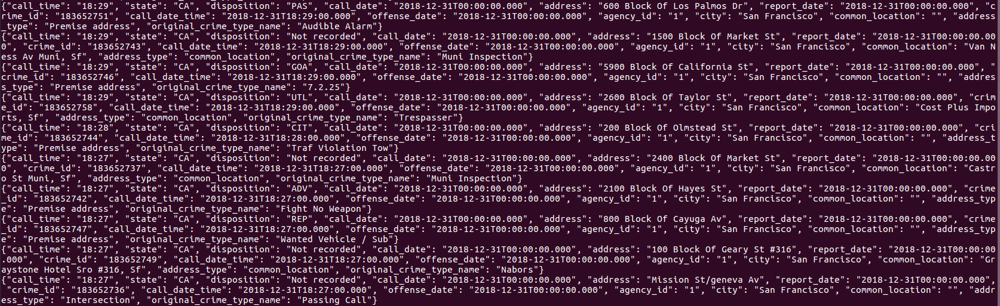
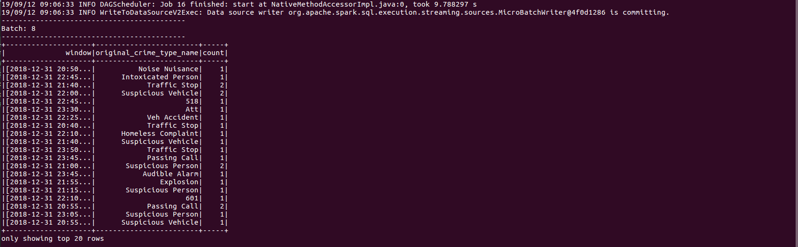
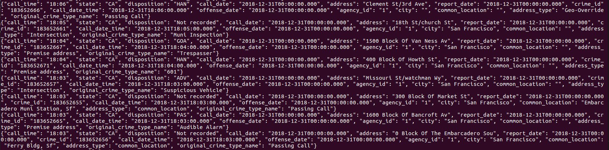

# SF Crime Statistics with Spark Streaming Readme

Hi there,

Just a few points I would like to point out so that you keep in mind while reviewing

I got the `sf-police-calls-for-service-and-incidents` from kaggle and converted the `police-department-calls-for-service.csv` file to `police-department-calls-for-service.json` which had the required dataset as could be seen in the image on the project overview that showed the kind of data we are expecting to see after running our producer server. I adjusted the naming of the key field from uppercses to underscores to match starter code. I also had to cut down the size of the dataset since it was very heavy by reducing the amount of data that was inside.

After completing `producer_server.py` and running the kafka consumer, below is a screenshot of my result:

Upon completion of the `data_stream.py` and running with `spark-submit --packages org.apache.spark:spark-sql-kafka-0-10_2.11:2.3.0 --master local[4] data_stream.py`, below is a screenshot of my result on batch 8:

Finally, I wrote a `consumer_server.py` script to also demonstrate data consumption from the producer server script. Below is a screenshot of my result:

Thanks.
